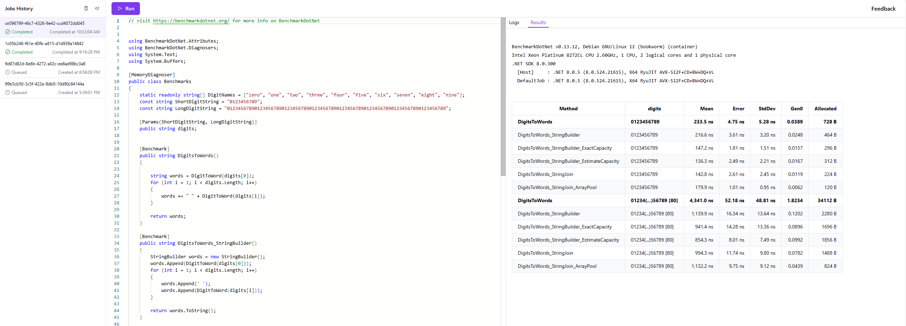
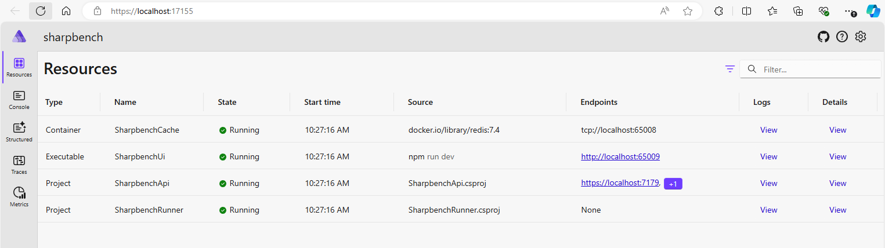

# Sharpbench

A playground for quick throwaway C# microbenchmarks.

Live at [https://sharpbench.dev](https://sharpbench.dev).



## Setting up for development

### Docker

Ensure you have docker installed and docker engine running on your machine.

[Download and install Docker Desktop](https://www.docker.com/products/docker-desktop/)

### Run the project with Aspire (recommended)

Make sure you have [.NET 8 SDK](https://dotnet.microsoft.com/en-us/download) installed on your machine.

We use [.NET Aspire](https://learn.microsoft.com/dotnet/aspire/get-started/aspire-overview) to run the project during development. .NET Aspire takes care of orchestrating and running the different components (frontend web app, API server, benchmark runner, redis cache), service discovery, and launching a dashboard that helps debug and monitor the different components.

Make sure you have .NET Aspire workload installed on your machine. If you're using Visual Studio 17.10+ you may already have it installed. Regardless, you can install manually with:

```dotnetcli
dotnet workload install aspire
```

If you run into issues setting up .NET Aspire, [check out the documentation](https://learn.microsoft.com/en-us/dotnet/aspire/fundamentals/setup-tooling).

Finally, to run the project:

- If using Visual Studio
  - Open the `sharpbench.sln` solution
  - Run the `sharpbench.AppHost` project (should be set as the default startup project)
- Visual Studio Code or other editors
  - Run the command `dotnet run --project sharpbench.AppHost`

You should see console output like:

```cli
info: Aspire.Hosting.DistributedApplication[0]
      Aspire version: 8.2.0+75fdcff28495bdd643f6323133a7d411df71ab70
info: Aspire.Hosting.DistributedApplication[0]
      Distributed application starting.
info: Aspire.Hosting.DistributedApplication[0]
      Application host directory is: C:\Users\clhabins\source\repos\other\sharpbench\sharpbench.AppHost
info: Aspire.Hosting.DistributedApplication[0]
      Now listening on: https://localhost:17155
info: Aspire.Hosting.DistributedApplication[0]
      Login to the dashboard at https://localhost:17155/login?t=xxxx
info: Aspire.Hosting.DistributedApplication[0]
      Distributed application started. Press Ctrl+C to shut down.
```

And the dashboard (see link to the dashboard in the console logs).



### Running the project components manually (alternative)

If you don't want to run the project using Aspire, or if you want to run the components individually, follow these steps (You should still make sure you have .NET 8+ SDK installed).

### Redis

Redis is used to queue jobs and store job results.

Redis needs to be installed and running before you launch the server.

[Download and install Redis](https://redis.io/docs/latest/operate/oss_and_stack/install/install-redis/)

Alternatively, you can run a redis server with docker without having to manually install it:

```cli
docker run -d --name sharpbench-redis -p 6379:6379  redis/redis-stack-server:latest
```

### Run the server

Make sure you have [.NET 8 SDK](https://dotnet.microsoft.com/en-us/download) installed on your machine.

The server project is located in the `server` directory. It exposes the REST API that receives benchmark jobs
from the user and sends them to the queue. It also sends real time benchmark logs and results back to the user.

```cli
cd server
```

Set the Redis connection string environment variable:

On Windows:

```cli
$env:ConnectionStrings__SharpbenchCache = "localhost"
```

On Linux/macOS

```cli
export ConnectionStrings__SharpbenchCache = "localhost"
```

Run the server:

```cli
dotnet run
```

### Run the benchmark runner

The benchmark runner picks a job from the queue, builds and runs the project using docker.

```cli
cd runner
```

Set the Redis connection string environment variable:

On Windows:

```cli
$env:ConnectionStrings__SharpbenchCache = "localhost"
```

On Linux/macOS

```cli
export ConnectionStrings__SharpbenchCache = "localhost"
```

Run the benchmark runner:

```cli
dotnet run
```

Note: Use `ctrl+c` to terminate the runner. This takes a few moments to take effect. This is an issue on the backlog.

### Run the frontend web app

Make sure you have [Node.js](https://nodejs.org) installed. I recommend [nvm-windows](https://github.com/coreybutler/nvm-windows) or [nvm](https://github.com/nvm-sh/nvm) to install and manage Node.js versions.

The frontend is the web-based user interface. It's located in the `webapp` folder.

```cli
cd webapp
```

Install dependencies

```cli
npm install
```

```cli
npm run dev
```

TODO: Use .NET Aspire to make it easier to run the project.